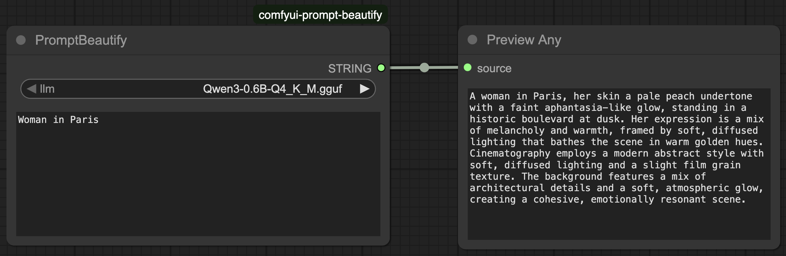

# ComfyUI node to beautify your image generation prompt




### Installation

To install and use the Prompt Beautify node with Manager, follow these steps:

1. Click on Manager.
2. Click on Button "Custom Node Manager".
3. Click on "Install via Git URL"
4. Enter "https://github.com/brenzel/comfyui-prompt-beautify.git"
5. Press Confirm
6. Restart ComfyUI.


To install and use the Prompt Beautify node without Manager, follow these steps:

1. Open a terminal or command line interface.
2. Navigate to the `ComfyUI/custom_nodes/` directory.
3. Run the following command:
```git clone https://github.com/brenzel/comfyui-prompt-beautify.git```
4. Restart ComfyUI.

This command clones the Prompt Beautify repository into your `ComfyUI/custom_nodes/` directory. You should now be able to access and use the node from this repository.